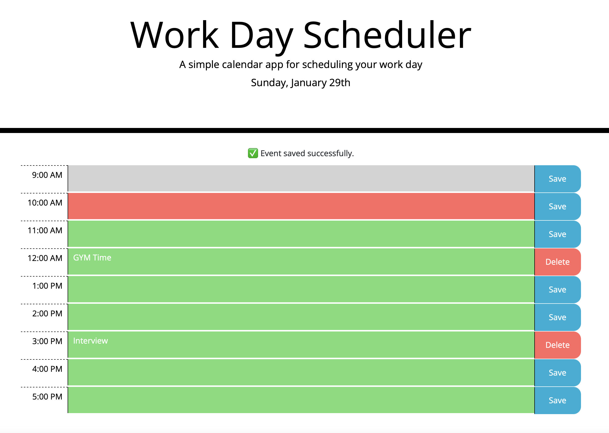

# Work Day Scheduler

## Description

This a simple calendar application that allows a user to save events for each hour of the day. It's created with HTML, CSS, JavaScript and Jquery.

## Installation

N/A

## Usage

You can see the image of the project below.
  

## Links

<b>Source Code</b>
 
https://github.com/ozgencmardi/work-day-scheduler

<b>Website URL</b>
 
https://ozgencmardi.github.io/work-day-scheduler

## Credits

N/A

## License

Please refer to the LICENSE in the repo.